# 般若安全中心

**般若的正确读音是bore，项目名就不改啊**
## 文章

https://www.freebuf.com/sectool/176414.html

## 安装教程
**该系统环境是python3.6运行的，3.7会显示错误。**

具体安装过程就不一一说明，下面直接dockerfile,假如没有fortify，只是用里面渗透测试系统，可以直接注释掉那段fortify的配置。在banruo目录下有一个config.json文件，里面有所有的配置，在生成docker的时候，把config.json复制出来，修改里面的内容。
```
#dockerfile

FROM centos:7
COPY fortify_linux /opt/fortify_linux


RUN yum update -y
RUN yum install epel-release -y
RUN yum install -y  git wget python36 gcc python36-libs python36-tools python36-devel   zlib-devel rpm-build openssl-devel python redis

#django
RUN cd /opt && git clone https://github.com/yingshang/banruo.git
RUN cd /opt/banruo && pip3 install -r requirements.txt
RUN cd /opt/banruo && python3 manage.py makemigrations && python3 manage.py migrate

#这个是fortify的运行程序
RUN mkdir /data && mkdir /data/fortify && mkdir /data/fortify/report && chmod 777 /data -R
RUN chmod 777 -R /opt/fortify_linux/ && ln -s /opt/fortify_linux/bin/sourceanalyzer /usr/local/bin/sourceanalyzer && ln -s /opt/fortify_linux/bin/ReportGenerator /usr/local/bin/ReportGenerator

#sqlmap
RUN mkdir /opt/taskid
RUN cd /opt && git clone https://github.com/sqlmapproject/sqlmap
RUN ln -s /opt/sqlmap/sqlmapapi.py /usr/bin/sqlmapapi


#config.json
COPY config.json /opt/banruo/banruo/

#ENTRYPOINT redis-server & && cd /opt/ && python3 manage.py celery -A banruo worker  -l info --beat & && python3 manage.py runserver 0.0.0.0:8000


```
config.json

```
{
  "setting": {
    "MYSQL": {
      "MYSQL_HOST": "127.0.0.1",
      "MYSQL_PORT": "3306",
      "MYSQL_DATABASE": "banruo",
      "MYSQL_USER": "root",
      "MYSQL_PASSWORD": "123456"
    },
    "SQLMAP": {
      "SQLMAP_LIMIT_RUN": 15,
      "SQLMAP_DBMS": "",
      "SQLMAP_REQUESTFILE_PATH": "/opt/taskid/",
      "SQLMAP_VERBOSE": 1,
      "SQLMAP_PROXY": "",
      "SQLMAP_LEVEL": 5,
      "SQLMAP_RISK": 3,
      "SQLMAP_THREADS": 1,
      "SQLMAP_PARMEXCLUDE": "Host,User-Agent,Accept-Language,Referer,Cookie",
      "SQLMAP_PROXYFILE": "",
      "SQLMAP_RETRIES": 5,
      "SQLMAP_API_SERVER": [
        "http://127.0.0.1:55000",
        "http://127.0.0.1:55001",
        "http://127.0.0.1:55002",
        "http://127.0.0.1:55003"
      ]
    },
    "PROXY": {
      "PROXY_LISTEN_HOST": "0.0.0.0",
      "PROXY_LISTEN_PORT": 9999,
      "PROXY_LISTEN_MODE": "regular",
      "EXCLUDE_STATIC_FILE": [
        ".js",
        ".txt",
        ".mp3",
        ".css",
        ".jpg",
        ".png",
        ".gif",
        ".woff",
        ".ico",
        ".pdf",
        ".mp4"
      ]
    },
    "FORTIFY": {
      "fortify_path": "/data/fortify/",
      "report_path": "/data/fortify/report/",
      "filter_title": [
        "Injection",
        "Cross-Site Scripting"
      ]
    },
    "GITLAB": {
      "GIT_PATH": "/opt/git-list",
      "GIT_USERNAME": "admin@example.com",
      "GIT_PASSWORD": "abc123456",
      "GIT_API_CHOICE": 1,
      "GIT_ADDRESS": "http://test.com/api.json",
      "GIT_PARM": "giturl"
    }
    "CHANDAO": {
      "OPENEDBY": 1,
      "PRODUCT_ID": 1,
      "CHAODAO_MYSQL_HOST": "192.168.1.210",
      "CHAODAO_MYSQL_USER": "root",
      "CHAODAO_MYSQL_PASSWORD": "123456",
      "CHAODAO_MYSQL_DATABASE": "zendao",
      "CHAODAO_MYSQL_PORT": 3306,
      "EMAIL_RECEIVERS": [
        "xxx@163.com"
      ]
    },
    "EMAIL": {
      "MAIL_HOST": "smtp.163.com",
      "MAIL_USER": "w@163.com",
      "MAIL_PASSWORD": ""
    }
  }
}
```
## 配置说明
- mysql配置（忽略）
- sqlmap配置
1. SQLMAP_LIMIT_RUN，限制sqlmap跑的进程数
2. SQLMAP_REQUESTFILE_PATH：保存数据包的位置
3. SQLMAP_PARMEXCLUDE：排除的参数（level3以上）
4. SQLMAP_API_SERVER：连接sqlmapapi，需要多开，因为sqlmap多了之后，一个api服务器跑不动，会死掉

- 代理配置
1. EXCLUDE_STATIC_FILE：排除静态文件
- fortify配置
1. fortify_path：保存源码位置
2. report_path：保存报告的位置
3. filter_title：过滤高危的漏洞，比如sql注入，xss
- gitlab配置
1. git_api_choice：有两种选择，1，本地文件，里面都写了要扫描的github地址（推荐）; 2,接口模式，请求网站获取扫描地址。
2. git_address：项目地址列表
3. GIT_ADDRESS:模式2，接口地址
4. GIT_PARM：模式2，json参数,例如{"giturl":[1,2,3,4]}
- 禅道配置
1. OPENEDBY：创建人ID
2. PRODUCT_ID：项目的ID
3. EMAIL_RECEIVERS：接受禅道提醒的邮箱
- 邮箱配置(忽略)

## 模拟测试
下载gitlab
```
docker run -d -p 4443:443 -p 8080:80 -p 2222:22  --name gitlab  --restart always  -v /srv/gitlab/config:/etc/gitlab   -v /srv/gitlab/logs:/var/log/gitlab      -v /srv/gitlab/data:/var/opt/gitlab  gitlab/gitlab-ce:latest
```
下载禅道系统

```
docker run -it -p 8888:80 zhuang1125/zendao:11.6.4
```

下载svn

```
docker run --name svn -d --restart always  -v /srv/SVNRepository:/var/opt/svn  -p 3690:3690  garethflowers/svn-server
```
### 仪表盘
各种图表展示，待完善

### 代码审计系统
我设计是分四种场景
- 第一种是针对于单个gitlab(github)项目进行扫描审计，只需要输入项目地址，有账号和密码就输入账号和密码。
- 第二种是针对于多个gitlab(github)项目进行扫描审计，有两种扫描选择，一种是选择本地列表，另外一种就是选择接口。
- 第三种是针对svn项目进行扫描审计（不过我几乎没用svn，就没怎么管）
- 第四种是针对压缩包上传进行扫描审计。


可以看到扫描状态和扫描的类型,漏洞数目
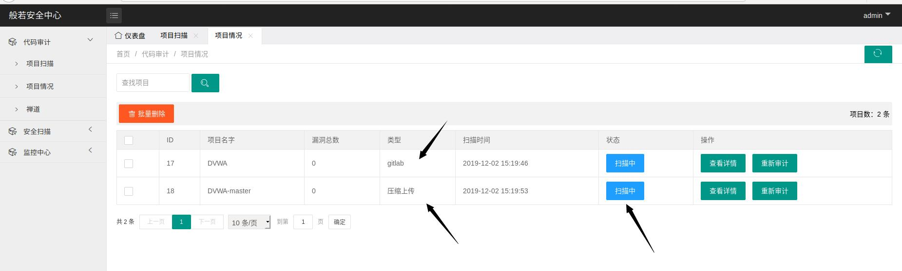
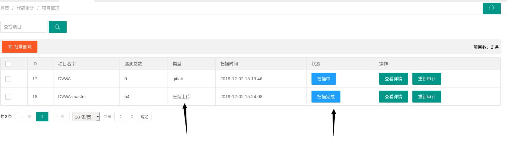
点击查看详情就可以看到统计图和漏洞细节

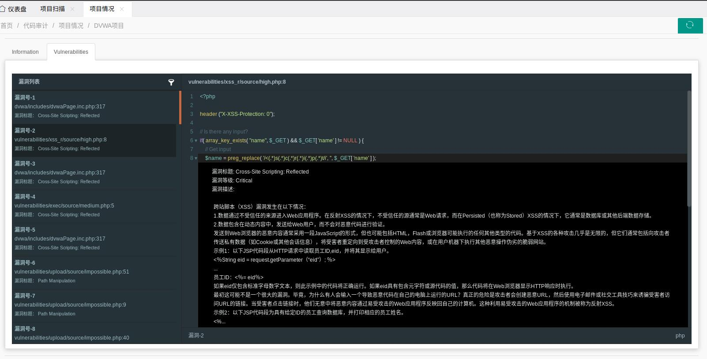
这里面有个风险等级过滤和漏洞标题过滤
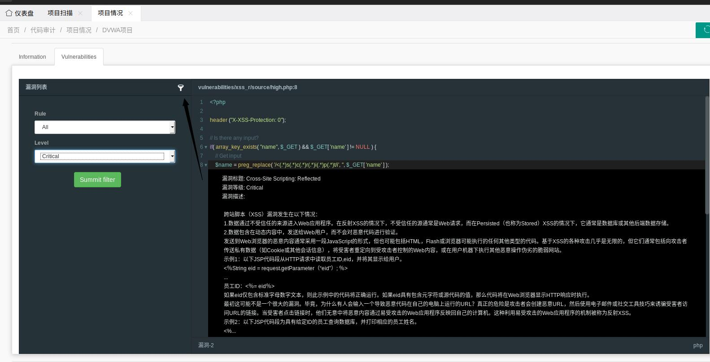
**下面还有一个已知的问题，就是fortify构建之后，生成的报告目录有问题**

有兴趣的人可以试试，用bwapp，https://github.com/raesene/bWAPP
它的源码不在第一层目录下，而是在app目录下，这样会导致最后生成的源码的位置是/opt/data/fortify/bWAPP/test.php,而不是/opt/data/fortify/bWAPP/app/test.php。为什么不解决？因为报告是fortify生成的，假如有两个同名的文件，你怎么知道它是那个目录的？不过最后那边也有路径，所以也无关紧要的
一般情况下，不会出现这种情况的。
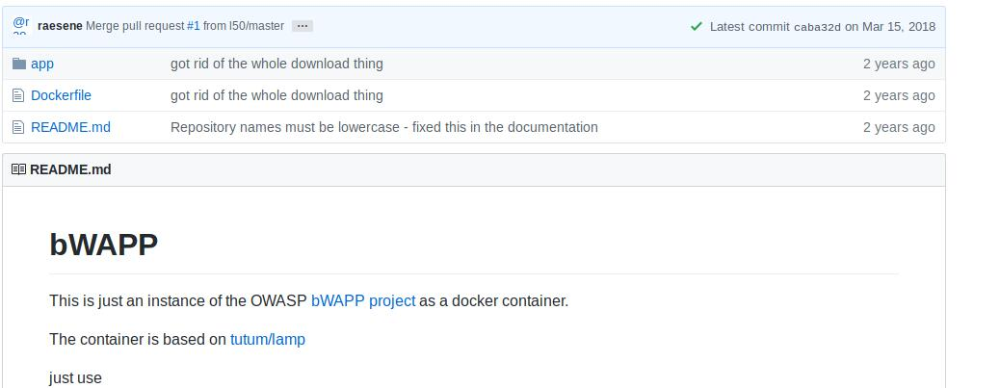
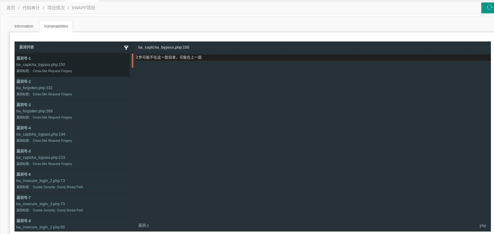
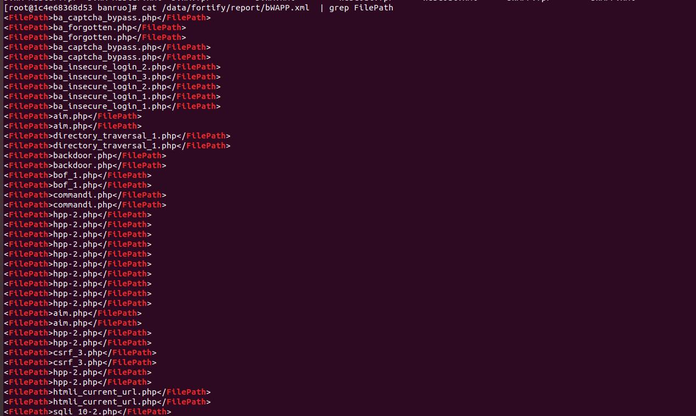

**运行gitlab系统**
进去之后初始化密码，用户是root。
创建一个项目dvwa，往里面导入源码


**使用本地文件扫描**

```angular2
[root@1c4e68368d53 banruo]# touch /opt/git-list
[root@1c4e68368d53 banruo]# vim /opt/git-list
[root@1c4e68368d53 banruo]# cat /opt/git-list 
http://192.168.17.131:8080/root/dvwa.git
```
配置文件
```angular2
"GITLAB": {
      "GIT_PATH": "/opt/git-list",
      "GIT_USERNAME": "root",
      "GIT_PASSWORD": "aA123456",
      "GIT_API_CHOICE": 1,
      "GIT_ADDRESS": "http://test.com/api.json",
      "GIT_PARM": "giturl"
    }
```

**接口模式扫描**

配置文件
```angular2
"GITLAB": {
      "GIT_PATH": "/opt/git-list",
      "GIT_USERNAME": "root",
      "GIT_PASSWORD": "aA123456",
      "GIT_API_CHOICE": 2,
      "GIT_ADDRESS": "http://test.com/api.json",
      "GIT_PARM": "giturl"
    }
```
api.json
```angular2
{"giturl":["http://github.com/dvwa.git"]}
```

**运行禅道系统**

```angular2
https://LOCALHOST_IP:8088   
default user/passwd: admin/123456
```
进入到禅道系统之后，新建一个产品叫安全审计，在项目添加对应的git的项目，添加负责人，可以用一个excel表导入数据库

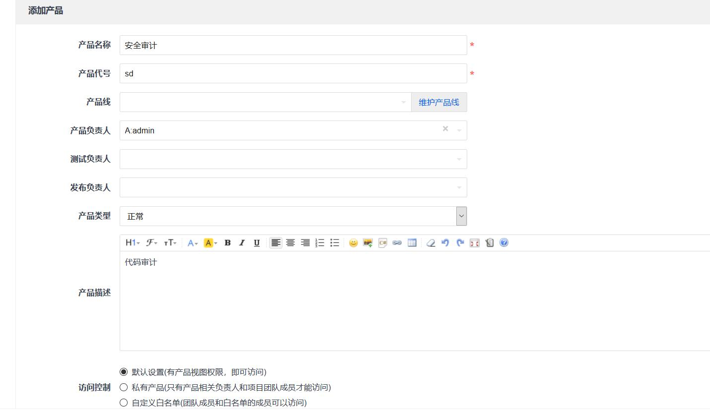

数据库的配置

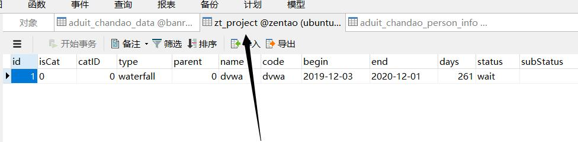
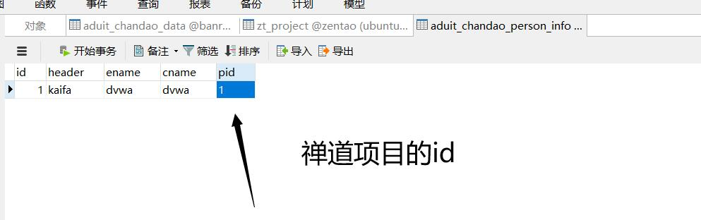

将漏洞发送到禅道上面，有个隐藏漏洞功能，就是将漏洞不发送到禅道上面。这里面有个问题，需要在禅道上面有这个项目，比如dvwa这样。

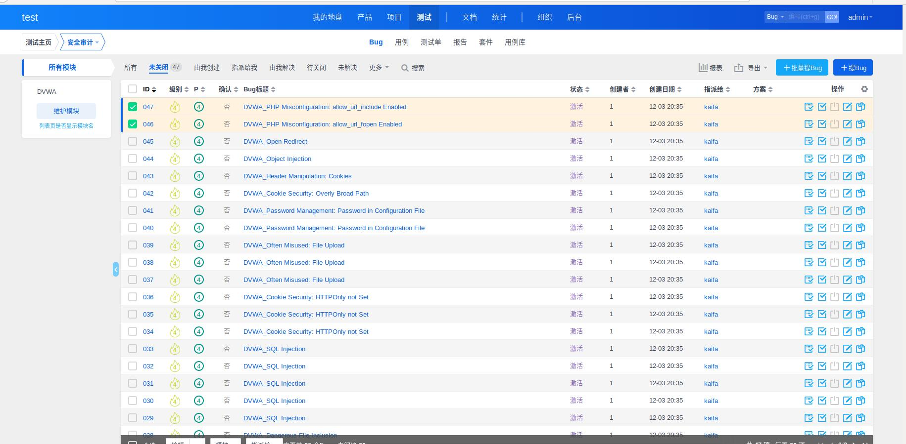
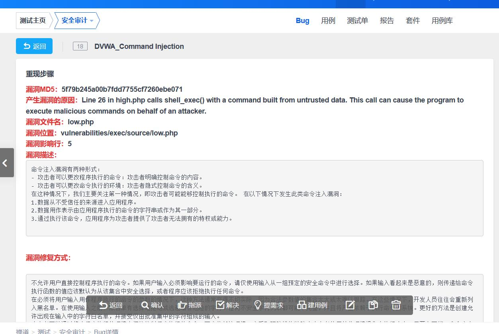

邮件发送功能可以设置定时计划进行发送，提醒开发继续修复漏洞。

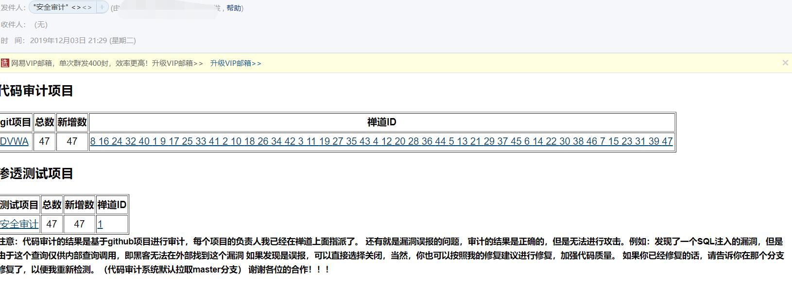

配置文件

```

"CHANDAO": {
      "OPENEDBY": 1,
      "PRODUCT_ID": 1,
      "CHAODAO_MYSQL_HOST": "192.168.17.131",
      "CHAODAO_MYSQL_USER": "root",
      "CHAODAO_MYSQL_PASSWORD": "123456",
      "CHAODAO_MYSQL_DATABASE": "zendao",
      "CHAODAO_MYSQL_PORT": 3306,
      "CHANDAO_ADDRESS": "http://192.168.17.131:8888",
      "EMAIL_RECEIVERS": [
        "xxx@163.com"
      ]
    }
```

### 渗透测试系统
①代理抓包
基于mitmproxy==2.0.2，无法用更高级，因为它变成了插件模式。
配置文件,这样的配置，我将监听0.0.0.0：9999,使用的模式是正常的代理模式，还有几种模式跟渗透无关，就没不用了。

```
"PROXY": {
      "PROXY_LISTEN_HOST": "0.0.0.0",
      "PROXY_LISTEN_PORT": 9999,
      "PROXY_LISTEN_MODE": "regular",
      "EXCLUDE_STATIC_FILE": [
        ".js",
        ".txt",
        ".mp3",
        ".css",
        ".jpg",
        ".png",
        ".gif",
        ".woff",
        ".ico",
        ".pdf",
        ".mp4"
      ]
    },

```

进去之后，在代理栏点击开始监听按钮
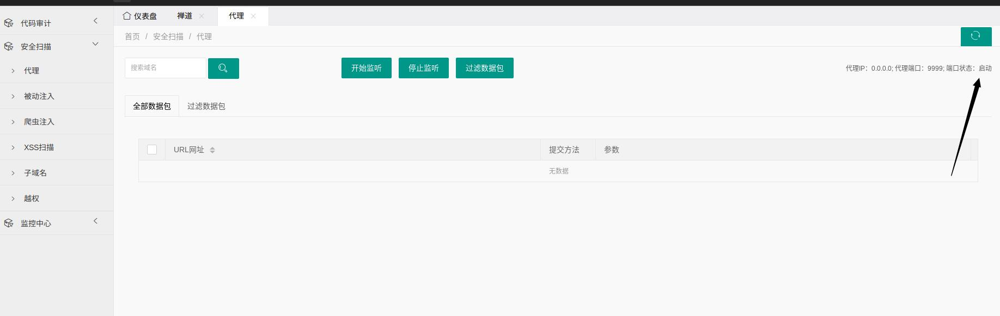

在浏览器设置代理之后，就可以随便点击页面，输入数据，下面可以看到已经抓包成功

**我设置了两个数据包显示页面，一个是显示全部数据包，一个是过滤重复数据包之后的页面**

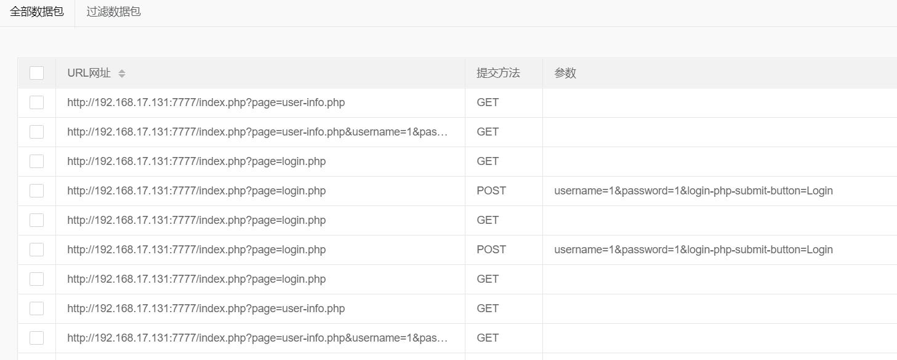
点击过滤数据包按钮，在过滤数据包一栏可以看到去重之后的数据包

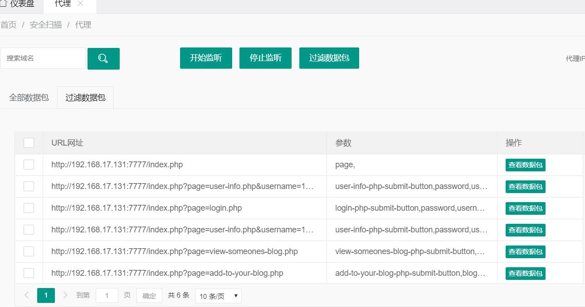

查看数据包选项可以查看完整的数据包

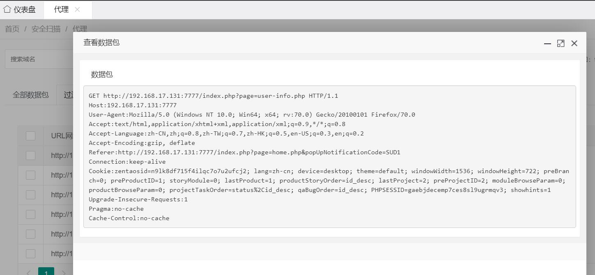

整个数据包处理的流程就到这里，下面你就可以对这些数据包为所欲为。注意停止监听选项无法停止。

来到被动注入的位置
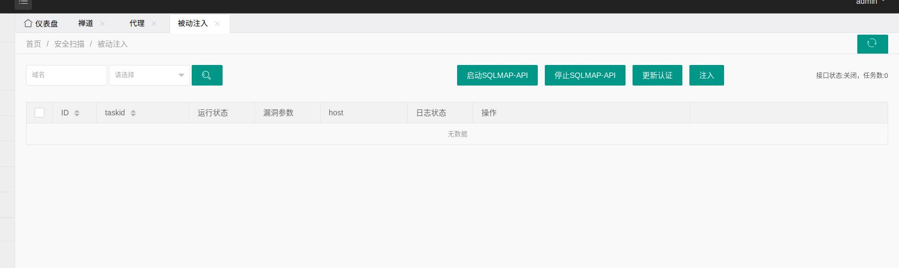

可以选择运行状态和漏洞状态

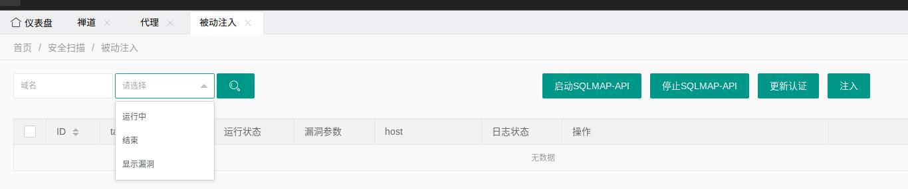


我写了一个更新会话功能，主要面向于两种情况，一种是cookie失效，一种是token失效

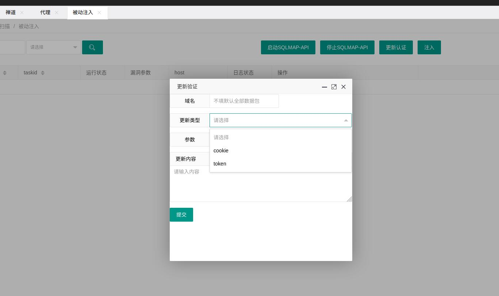

注入可以对过滤之后的数据包全部注入测试，也可以只跑没有测试的数据包，还可以选择域名进行测试注入
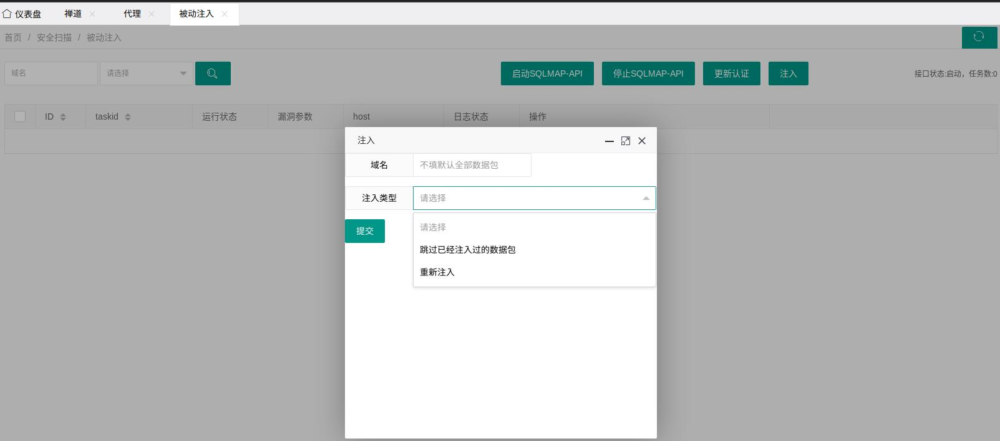

## 功能模块
- 代码审计系统
1. 单独git扫描
2. 接口扫描
3. 单独svn扫描
4. 压缩包上传扫描
5. 对接禅道系统
- 渗透测试系统
1. 代理抓包
2. 自动化注入
3. 自动化xss（待写）
4. 越权检测（写了一半）
5. 子域名爆破+端口扫描+poc扫描（待写）

- 安全监控系统
1. 蜜罐监控+收集样本（写了一半）
2. 源代码防泄漏平台（待写）

- 安全资讯系统
1. 抓取别人新闻+邮件发送+邮件订阅（待写）
